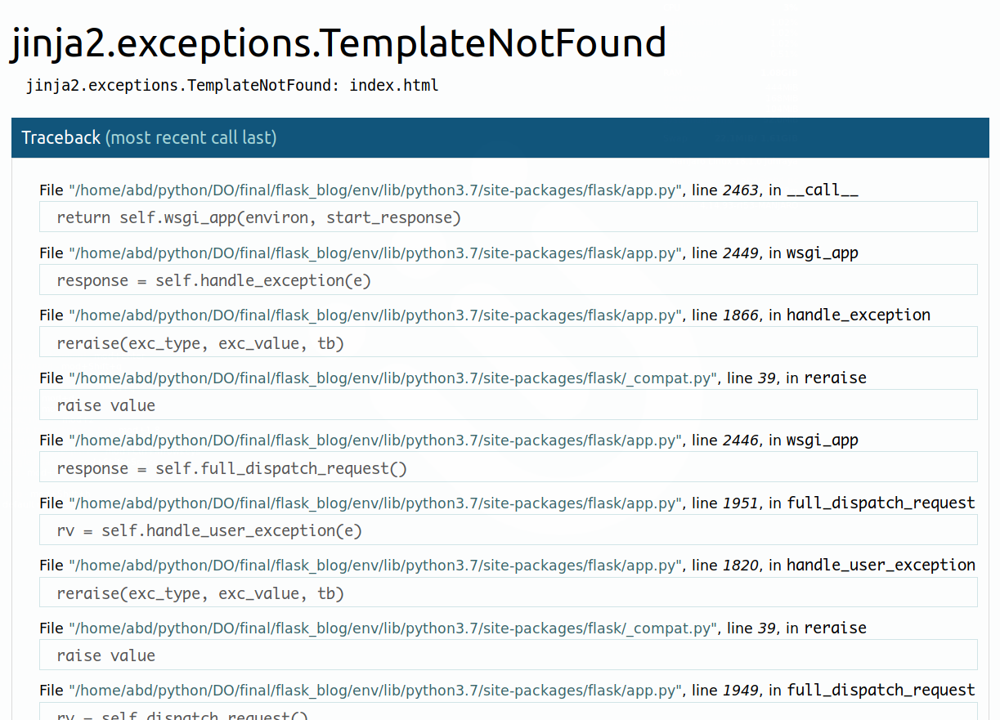
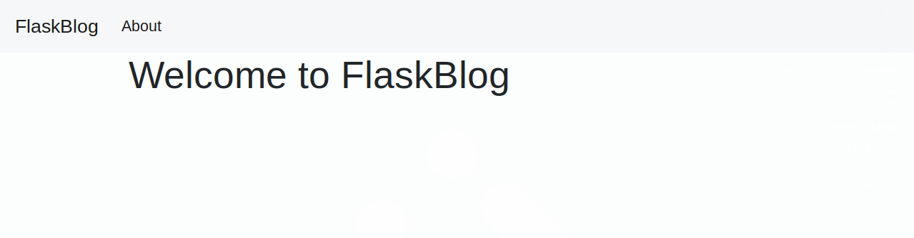
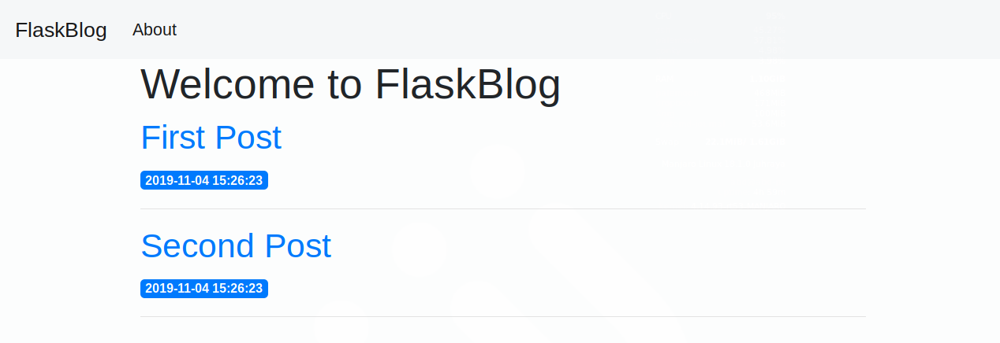
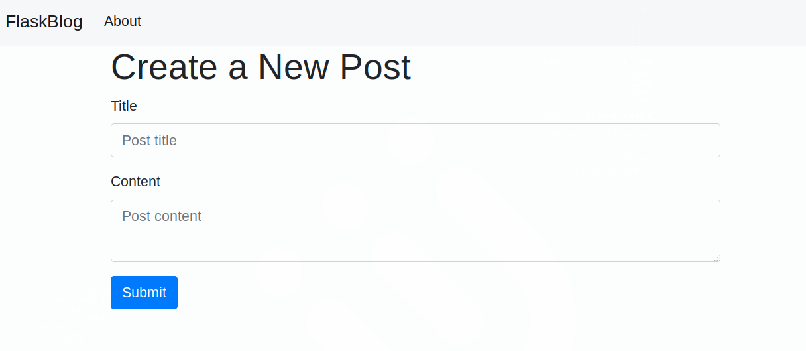
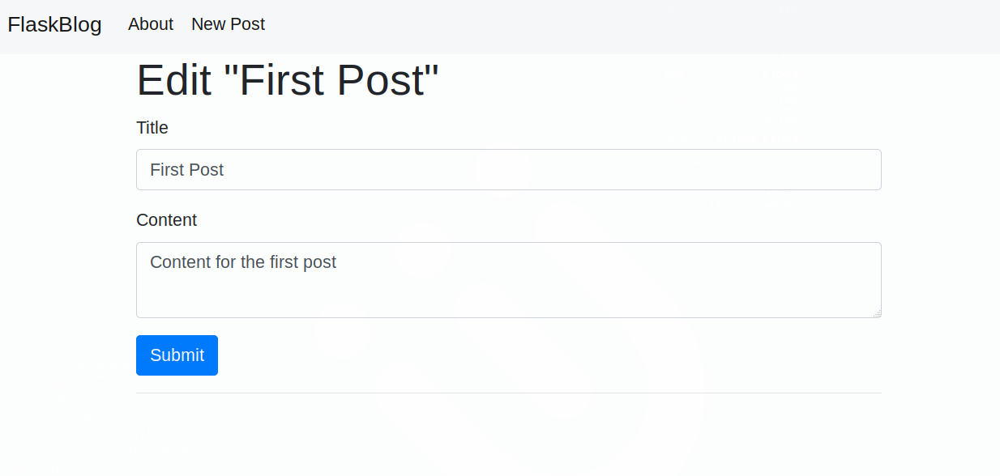

# Создание веб-приложения с помощью Flask в Python 3

**Введение**

[Flask](http://flask.pocoo.org/) — это небольшой и легкий веб-фреймворк, написанный на языке Python, предлагающий полезные инструменты и функции для облегчения процесса создания веб-приложений с использованием Python. Он обеспечивает гибкость и является более доступным фреймворком для новых разработчиков, так как позволяет создать веб-приложение быстро, используя только один файл Python. Flask — это расширяемая система, которая не обязывает использовать конкретную структуру директорий и не требует сложного шаблонного кода перед началом использования.

В рамках этого обучающего руководства вы будете использовать [инструментарий Bootstrap](https://getbootstrap.com/), чтобы сделать ваше приложение визуально привлекательным. Bootstrap поможет вам включить в ваше веб-приложение быстрые веб-страницы, чтобы приложение можно было использовать на мобильных браузерах без написания для этого собственных кодов HTML, CSS и JavaScript. Инструментарий дает возможность изучить работу Flask.

Flask использует [механизм шаблонов Jinja](http://jinja.palletsprojects.com/) для динамического создания HTML-страниц с использованием знакомых понятий в Python, таких как переменные, циклы, списки и т. д. Вы будете использовать эти шаблоны в рамках этого проекта.

С помощью этого обучающего руководства вы создадите небольшой веб-блог с использованием Flask и [SQLite](https://sqlite.org/) в Python 3. Пользователи приложения могут видеть все посты в вашей базе данных и нажимать на заголовки постов для просмотра их содержания. Кроме того, присутствует возможность добавлять новый пост в базу данных и редактировать или удалять существующий пост.

## Предварительные требования

Перед началом выполнения этого руководства вам потребуется:

* Локальная среда программирования Python 3. Следуйте инструкциям из обучающего руководства [Установка и настройка локальной среды программирования для Python 3](https://www.digitalocean.com/community/tutorial_series/how-to-install-and-set-up-a-local-programming-environment-for-python-3) для вашего локального компьютера. В этом обучающем руководстве мы назовем директорию проекта `flask_blog`.
* Понимание концепций Python 3, таких как [типы данных](https://www.digitalocean.com/community/tutorials/understanding-data-types-in-python-3), [условные выражения](https://www.digitalocean.com/community/tutorials/how-to-write-conditional-statements-in-python-3-2), [циклы for](https://www.digitalocean.com/community/tutorials/how-to-construct-for-loops-in-python-3), [функции](https://www.digitalocean.com/community/tutorials/how-to-define-functions-in-python-3) и другие. Если вы не знакомы с Python, воспользуйтесь нашей серией [Программирование на Python 3](https://www.digitalocean.com/community/tutorial_series/how-to-code-in-python-3).

## Шаг 1 — Установка Flask

На этом этапе вы активируете вашу среду Python и установите Flask с помощью установщика пакетов [`pip`](https://pypi.org/project/pip/).

Если вы еще не активировали среду программирования, убедитесь, что находитесь в директории проекта (`flask_blog`), и с помощью следующей команды активируйте среду:

```bash
source env/bin/activate
```

После активации среды программирования в вашей командной строке появится префикс `env`, и она будет выглядеть следующим образом:

```bash
(env)sammy@localhost:$
```

Данный префикс служит индикатором того, что среда `env` активна (имя среды может быть другим, в зависимости от того, как вы назвали ее при создании).



**Примечание.** Вы можете использовать [Git](https://git-scm.com/), систему контроля версий, для эффективного управления и отслеживания процесса разработки вашего проекта. О том, как использовать Git, вы можете узнать из нашей статьи [Введение в Git: установка, использование и ответвления](https://www.digitalocean.com/community/tutorial_series/introduction-to-git-installation-usage-and-branches).

Если вы используете Git, рекомендуем игнорировать вновь созданную директорию `env` в файле `.gitignore`, чтобы избежать отслеживания файлов, не связанных с проектом.



Теперь вы можете установить пакеты Python и изолировать ваш код проекта от основной системы Python. Это делается с помощью `pip` и `python`.

Чтобы установить Flask, запустите следующую команду:

```bash
pip install flask
```

После завершения установки запустите следующую команду, чтобы подтвердить установку:

```bash
python -c "import flask; print(flask.__version__)"
```

Используйте [интерфейс командной строки `python`](https://docs.python.org/3/using/cmdline.html) с опцией `-c` для выполнения кода Python. Далее вы импортируете пакет `flask` с помощью `import flask`; и затем распечатываете версию Flask через переменную `flask.__version__`.

В результате вы увидите номер версии, который будет выглядеть примерно так:

```text
Output
1.1.2
```

Вы создали папку проекта, виртуальную среду и установили Flask. Теперь вы готовы переходить к настройке базового приложения.

## Шаг 2 — Создание базового приложения

Теперь, когда вы настроили среду программирования, можно начинать использовать Flask. На этом этапе вы создадите небольшое веб-приложение внутри файла Python и запустите его для начала работы сервера, который отобразит определенную информацию в браузере.

В директории `flask_blog` откройте файл с именем `hello.py` для редактирования. Используйте `nano` или любой другой текстовый редактор:

```bash
nano hello.py
```

Этот файл `hello.py` будет служить минимальным примером того, как обрабатывать запросы HTTP. Внутри него импортируйте [объект `Flask`](https://flask.palletsprojects.com/en/1.1.x/api/#flask.Flask) и создайте функцию, которая возвращает ответ HTTP. Напишите следующий код внутри файла `hello.py​​​`:

```python
from flask import Flask

app = Flask(__name__)


@app.route('/')
def hello():
    return 'Hello, World!'
```

В предыдущем блоке кода необходимо предварительно импортировать объект `Flask` из пакета `flask`. Затем вы создаете ваш экземпляр приложения Flask с именем `app`. Вы передаете специальную переменную `__name__`, которая содержит имя текущего модуля Python. Она указывает экземпляру его расположение. Это необходимо, так как Flask устанавливает ряд путей за кадром.

Создав экземпляр `app`, вы начинаете используете его для обработки поступающих веб-запросов и отправки ответов пользователю. `@app.route`​​​ — это [декоратор](https://en.wikipedia.org/wiki/Python_syntax_and_semantics#Decorators), который превращает стандартную функцию Python в _функцию просмотра_ Flask, конвертирующую возвращаемое значение функции в ответ HTTP, который отображается клиентом HTTP, например веб-браузером. Вы передаете значение `'/'` в `@app.route()​​`​ для обозначения того, что эта функция будет отвечать на веб-запросы для URL `/`, который является основным URL-адресом.

Функция просмотра `hello()` возвращает строку `'Hello, World!'` в качестве ответа.

Сохраните и закройте файл.

Для запуска вашего веб-приложения сначала укажите Flask, где искать приложение (в вашем случае файл `hello.py`) с помощью переменной среды `FLASK_APP`:

```bash
export FLASK_APP=hello
```

Затем запустите его в режиме разработки с помощью переменной среды `FLASK_ENV`:


```bash
export FLASK_ENV=development
```

И наконец, запустите приложение, используя команду flask run:

```bash
flask run
```

После запуска приложения вы увидите примерно следующее:

```text
Output
 * Serving Flask app "hello" (lazy loading)
 * Environment: development
 * Debug mode: on
 * Running on http://127.0.0.1:5000/ (Press CTRL+C to quit)
 * Restarting with stat
 * Debugger is active!
 * Debugger PIN: 813-894-335
```

В предыдущем выводе представлена следующая информация:

* Название работающего приложения.
* Среда, в которой работает приложение.
* `Debug mode: on` означает, что отладчик Flask работает. Эта функция полезна при разработке, так как при возникновении проблем она выдает детализированные сообщения об ошибке, что упрощает работу по их устранению.
* Приложение работает локально на URL `http://127.0.0.1:5000/`, где `127.0.0.1` — это IP-адрес `localhost` вашего компьютера, а `:5000` — номер порта.
Откройте браузер и введите URL `​​​​​​http://127.0.0.1:5000/`​​​​​​. Вы получите строку `Hello, World!` в качестве ответа. Это подтверждает то, что ваше приложение успешно работает.



**Внимание.** Flask использует простой веб-сервер для обслуживания нашего приложения в среде разработки, что также означает, что отладчик Flask работает для облегчения работы по обнаружению ошибок. Этот сервер для разработки не должен использоваться при развертывании в производственной среде. Дополнительную информацию можно найти в документации Flask на странице [Опции развертывания](https://flask.palletsprojects.com/en/1.1.x/deploying/) или в обучающем [руководстве по развертыванию Flask](https://www.digitalocean.com/community/tutorials/how-to-serve-flask-applications-with-gunicorn-and-nginx-on-ubuntu-18-04).



Теперь вы можете оставить сервер разработки работать в терминале и открыть другое окно терминала. Перейдите в папку проекта, где находится файл `hello.py​​​`, активируйте виртуальную среду, установите переменные среды `FLASK_ENV` и `FLASK_APP`, а затем выполните следующие шаги (эти команды перечислены ранее на этом шаге).



**Примечание.** При открытии нового терминала важно помнить об активации виртуальной среды и настройке переменных среды `FLASK_ENV` и `FLASK_APP`.

Если сервер разработки приложения Flask работает, невозможно запустить еще одно приложение Flask с помощью такой же команды `flask run`. Это связано с тем, что `flask run` по умолчанию использует номер порта `5000`, следовательно, когда он занят, невозможно запустить другое приложение, поэтому вы увидите ошибку аналогичную этой:

```bash
Output
OSError: [Errno 98] Address already in use
```

Для решения этой проблемы нужно либо остановить работающий в настоящий момент сервер с помощью команды `CTRL+C`, а затем снова задать команду `flask run`, или, если вам нужно,чтобы оба сервера работали одновременно, передать другой номер порта в аргумент `-p`, например запустить другое приложение через порт `5001`, используя следующую команду:

```bash
flask run -p 5001
```



Теперь у вас есть небольшое веб-приложение Flask. Вы запустили ваше приложение и вывели информацию в браузере. Далее вы будете использовать файлы HTML в вашем приложении.

## Шаг 3 — Использование шаблонов HTML

Сейчас ваше приложение отображает только простое сообщение без какого-либо HTML. Веб-приложения в основном используют HTML для отображения информации для посетителя, поэтому теперь вы можете заняться включением в ваше приложение файлов HTML, которые можно отобразить в браузере.

Flask предлагает вспомогательную функцию `render_template()`, которая позволяет использовать [механизм шаблонов Jinja](http://jinja.pocoo.org/). Это упрощает работу с HTML благодаря написанию вашего кода HTML в файлах `.html`, а также использованию логики в вашем коде HTML. Вы будете использовать файлы HTML (_шаблоны_) для создания всех страниц вашего приложения, например главной страницы, где будут отображаться текущие посты блога, страницы поста блога, страницы, на которой пользователь сможет добавить новый пост и т. д.

На этом этапе вы создадите свое основное приложение Flask в новом файле.

Сначала в директории `flask_blog` с помощью `nano` или другого редактора создайте и отредактируйте файл `app.py`. Здесь будет хранить весь код, который вы будете использовать для создания приложения с блогом:

```bash
nano app.py
```

В этом новом файле вы сможете импортировать объект `Flask` для создания экземпляра приложения Flask так же, как вы делали ранее. Кроме того, вы сможете импортировать вспомогательную функцию `render_template()`, позволяющую поставлять файлы шаблонов HTML, существующих в папке `templates`, которую вы создадите. Файл будет иметь единичную функцию просмотра, отвечающую за обработку запросов по основному маршруту `/`. Добавьте следующее содержимое:

```python
flask_blog/app.py
from flask import Flask, render_template

app = Flask(__name__)

@app.route('/')
def index():
    return render_template('index.html')
```


Функция просмотра `index()` возвращает результат вызова `render_template()` с `index.html​`​ в качестве аргумента. Это дает указание `render_template()` искать файл с именем `index.html` в _папке шаблонов_. И папка, и файл еще отсутствуют. Вы получите сообщение об ошибке, если запустите приложение на этом этапе. Тем не менее при запуске вы уже будете знать об этой часто встречающейся ошибке. Затем вы сможете исправить ошибку, создав необходимые папку и файл.

Сохраните и закройте файл.

Остановите сервер разработки на другом терминале, на котором работает приложение `hello` с помощью `CTRL+C`.

Перед запуском приложения убедитесь, что вы корректно указали значение для переменной среды `FLASK_APP`, так как вы больше не используете приложение `hello`:

```bash
export FLASK_APP=app
flask run
```

После открытия URL `http://127.0.0.1:5000/` в вашем браузере страница отладчика сообщит вам, что шаблон `index.html` не был найден. Основная строка кода, которая привела к этой ошибке, будет выделена. В данном случае это строка `return render_template('index.html')`.

Если вы нажмете на эту строку, отладчик откроет код, и у вас будет дополнительный контекст для понимания и решения проблемы.



Для устранения данной ошибки создайте директорию с именем `templates` внутри директории `flask_blog`. Затем внутри нее откройте файл с именем `index.html​​​` для редактирования:

```bash
mkdir templates
nano templates/index.html
```

После этого добавьте следующий код HTML внутри `index.html​​`:

```html
<!DOCTYPE html>
<html lang="en">
<head>
    <meta charset="UTF-8">
    <title>FlaskBlog</title>
</head>
<body>
   <h1>Welcome to FlaskBlog</h1>
</body>
</html>
```

Сохраните файл и используйте свой браузер для перехода на `http://127.0.0.1:5000/` или обновите страницу. Теперь браузер должен отобразить текст `Welcome to FlaskBlog` в теге `<h1>`.

Помимо папки `templates` веб-приложения Flask также обычно имеют папку `static` для хостинга статичных файлов, таких как файлы CSS, файлы JavaScript и изображения, которые использует приложение.

Вы можете создать файл стилей `style.css`, чтобы добавить CSS в ваше приложение. Сначала создайте директорию с именем `static` внутри основной директории `flask_blog`:

```bash
mkdir static
```

Затем создайте другую директорию с именем `css` внутри директории `static` для хостинга файлов `.css`. Обычно это делается для упорядочивания статичных файлов в специальных папках. Например, файлы JavaScript обычно находятся в директории с именем `js`, изображения хранятся в директории `images` (или `img`) и т. д. Следующая команда создает директорию css внутри директории `static`:

```bash
mkdir static/css
```

После этого откройте файл `style.css` в директории `css` для редактирования:

```bash
nano static/css/style.css
```

Добавьте следующее правило CSS в файл `style.css`:

```css
h1 {
    border: 2px #eee solid;
    color: brown;
    text-align: center;
    padding: 10px;
}
```

Код CSS добавит границу, изменит цвет на коричневый, выравняет текст по центру и добавит небольшое дополнение к меткам `<h1>`.

Сохраните и закройте файл.

Далее откройте файл шаблона `index.html` для редактирования:

```bash
nano templates/index.html
```

Добавьте ссылку в файл `style.css` внутри раздела `<head>` файла шаблона `index.html`:

```html
. . .
<head>
    <meta charset="UTF-8">
    <link rel="stylesheet" href="{{ url_for('static', filename= 'css/style.css') }}">
    <title>FlaskBlog</title>
</head>
. . .
```

Для этого вы используете вспомогательную функцию [`url_for()](https://flask.palletsprojects.com/en/1.1.x/api/#flask.url_for)`​​​ для генерирования подходящего расположения файла. Первый аргумент указывает, что вы связаны со статичным файлом, а второй — это путь файла внутри статичной директории.

Сохраните и закройте файл.

После обновления страницы индекса вашего приложения вы увидите, что цвет текста `Welcome to FlaskBlog​​​` теперь коричневый, расположен по центру и добавлен внутри границы.

Используйте язык CSS для оформления стиля приложения и придавайте ему более привлекательный вид с помощью своего собственного дизайна. Однако, если вы не веб-дизайнер или не знакомы с CSS, воспользуйтесь [инструментарием Bootstrap](https://getbootstrap.com/), который предлагает простые в использовании компоненты для оформления приложения. В данном проекте мы будем использовать Bootstrap.

Вероятно, вы уже догадались, что создание другого шаблона HTML будет означать повторение основной части кода HTML, который уже написан вами в шаблоне `index.html`. Избежать ненужного повторения кода возможно благодаря файлу _базового шаблона_, из которого наследуются все ваши файлы HTML. Дополнительную информацию можно найти в статье [Наследование шаблонов в Jinja](https://jinja.palletsprojects.com/en/2.10.x/templates/#template-inheritance).

Для создания базового шаблона сначала необходимо создать файл с именем `base.html` внутри директории `templates`:

```bash
nano templates/base.html
```

Введите следующий код в шаблоне `base.html​​`:

```html
<!doctype html>
<html lang="en">
  <head>
    <!-- Required meta tags -->
    <meta charset="utf-8">
    <meta name="viewport" content="width=device-width, initial-scale=1, shrink-to-fit=no">

    <!-- Bootstrap CSS -->
    <link rel="stylesheet" href="https://stackpath.bootstrapcdn.com/bootstrap/4.3.1/css/bootstrap.min.css" integrity="sha384-ggOyR0iXCbMQv3Xipma34MD+dH/1fQ784/j6cY/iJTQUOhcWr7x9JvoRxT2MZw1T" crossorigin="anonymous">

    <title> </title>
  </head>
  <body>
    <nav class="navbar navbar-expand-md navbar-light bg-light">
        <a class="navbar-brand" href="{{ url_for('index')}}">FlaskBlog</a>
        <button class="navbar-toggler" type="button" data-toggle="collapse" data-target="#navbarNav" aria-controls="navbarNav" aria-expanded="false" aria-label="Toggle navigation">
            <span class="navbar-toggler-icon"></span>
        </button>
        <div class="collapse navbar-collapse" id="navbarNav">
            <ul class="navbar-nav">
            <li class="nav-item active">
                <a class="nav-link" href="#">About</a>
            </li>
            </ul>
        </div>
    </nav>
    <div class="container">
         
    </div>

    <!-- Optional JavaScript -->
    <!-- jQuery first, then Popper.js, then Bootstrap JS -->
    <script src="https://code.jquery.com/jquery-3.3.1.slim.min.js" integrity="sha384-q8i/X+965DzO0rT7abK41JStQIAqVgRVzpbzo5smXKp4YfRvH+8abtTE1Pi6jizo" crossorigin="anonymous"></script>
    <script src="https://cdnjs.cloudflare.com/ajax/libs/popper.js/1.14.7/umd/popper.min.js" integrity="sha384-UO2eT0CpHqdSJQ6hJty5KVphtPhzWj9WO1clHTMGa3JDZwrnQq4sF86dIHNDz0W1" crossorigin="anonymous"></script>
    <script src="https://stackpath.bootstrapcdn.com/bootstrap/4.3.1/js/bootstrap.min.js" integrity="sha384-JjSmVgyd0p3pXB1rRibZUAYoIIy6OrQ6VrjIEaFf/nJGzIxFDsf4x0xIM+B07jRM" crossorigin="anonymous"></script>
  </body>
</html>
```

Сохраните и закройте файл после редактирования.

Основная часть кода в предыдущем блоке состоит из стандартного HTML и кода, необходимого для Bootstrap. Теги `<meta>` содержат информацию для веб-браузера, тег `<link>` привязывает файлы CSS Bootstrap, а теги `<script>` являются ссылками на код JavaScript, который позволяет выполнить ряд дополнительных функций Bootstrap. Дополнительную информацию по этому вопросу можно найти в [документации Bootstrap](https://getbootstrap.com/).

Однако следующие выделенные части относятся к механизму шаблонов Jinja:

* ` `: [блок](https://jinja.palletsprojects.com/en/2.10.x/templates/#blocks), замещающий заголовок. Позже вы будете использовать его в других шаблонах для написания пользовательского заголовка для каждой страницы в приложении без перезаписи всего раздела `<head>` каждый раз.
* `{{ url_for('index')}}`: вызов функции, который возвращает URL для функции просмотра `index()`. Этот вариант отличается от прошлого вызова `url_for()`, который использовался для привязки статичного файла CSS. Он использует только один аргумент, а именно имя функции просмотра, и привязывается к маршруту, связанному с функцией вместо статичного файла.
* ` `: еще один блок, который будет замещен контентом в зависимости от _дочернего шаблона_ (шаблоны, которые наследуются из `base.html`), который заменит его.

Теперь, когда у вас есть базовый шаблон, вы можете воспользоваться преимуществом, используя наследование. Откройте файл `index.html`:

```bash
nano templates/index.html
```

Замените его содержание на следующее:

```html



    <h1> Welcome to FlaskBlog </h1>

```

В этой новой версии шаблона `index.html` вы используете тег `` для наследования из шаблона `base.html`. Затем вы расширите его, заменив блок `content` в базовом шаблоне на содержимое блока `content` из предыдущего блока кода.

Этот блок `content` содержит тег `<h1>` с текстом `Welcome to FlaskBlog` внутри блока `title`, который в свою очередь заменяет оригинальный блок `title` в шаблоне `base.html` текстом `Welcome to FlaskBlog`. Так вы можете избежать повторения одного и того же текста дважды, так как он используется и в качестве названия страницы, и в качестве заголовка, который появляется под панелью навигации, унаследованной от базового шаблона.

Наследование шаблона также дает возможность использовать код HTML из других шаблонов (в данном случае `base.html`) без повторения его при каждой необходимости.

Сохраните и закройте файл, а затем обновите страницу индекса в браузере. Вы увидите страницу с панелью навигации и оформленным заголовком.



Вы использовали шаблоны HTML и статичные файлы в Flask. Вы также использовали Bootstrap для начала оформления страницы и базовый шаблон для избежания повторения кода. В следующем шаге вы настроите базу данных, которая будет хранить данные вашего приложения.

## Шаг 4 — Настройка базы данных

На этом этапе вы настроите базу данных для хранения данных, в случае с вашим приложением — это посты блога. Вы также наполните базу несколькими примерами.

Вы будете использовать файл [базы данных SQLite](https://sqlite.org/) для хранения ваших данных, так как модуль [`sqlite3`](https://docs.python.org/3/library/sqlite3.html), который мы будем использовать для взаимодействия с базой, уже присутствует в стандартной библиотеке Python. Дополнительную информацию о SQLite можно найти в [этом обучающем руководстве](https://www.digitalocean.com/community/tutorials/how-and-when-to-use-sqlite).

Поскольку данные в SQLite хранятся в таблицах и столбцах, а ваши данные в основном состоят из постов блога, в первую очередь вам понадобится создать таблицу с именем `posts` и необходимыми столбцами. Вы создадите файл `.sql`, содержащий команды SQL для создания таблицы `posts` с несколькими столбцами. Затем вы будете использовать этот файл для создания базы данных.

Откройте файл с именем `schema.sql` внутри директории `flask_blog`:

```bash
nano schema.sql
```

Введите следующие команды SQL в этом файле:

```SQL
DROP TABLE IF EXISTS posts;

CREATE TABLE posts (
    id INTEGER PRIMARY KEY AUTOINCREMENT,
    created TIMESTAMP NOT NULL DEFAULT CURRENT_TIMESTAMP,
    title TEXT NOT NULL,
    content TEXT NOT NULL
);
```

Сохраните и закройте файл.

Первая команда SQL — это `DROP TABLE IF EXISTS posts;`.Она удаляет все уже существующие таблицы с именем `posts`, чтобы не создавать путаницу. Обратите внимание, что при использовании этих команд SQL будет удалено все содержимое базы данных, поэтому не записывайте ничего важного в веб-приложении до окончания изучения этого руководства и экспериментируйте с финальным результатом. Далее, команда `CREATE TABLE posts​​​` используется для создания таблицы `posts` со следующими столбцами:

* `id`: целое число, которое представляет собой _первичный ключ_. В базе данных будет присвоено уникальное значение каждой записи (посту блога).
* `created`: время создания поста блога. `NOT NULL` означает, что столбец не может быть пустым, а значение `DEFAULT` — это `CURRENT_TIMESTAMP​​​`, т. е. время добавления поста в базу. Точно так же как и в случае с `id`, вам не нужно указывать значение для этого столбца, так как он будет заполнен автоматически.
* `title`: заголовок поста.
* `content`: содержание поста.

Теперь, когда у вас есть схема SQL в файле `schema.sql`, вы сможете использовать ее для создания базы данных с помощью файла Python, который сформирует файл базы данных SQLite `.db`. Откройте файл с именем `init_db.py` внутри директории `flask_blog` с помощью любого предпочитаемого редактора:

```bash
nano init_db.py
```

А затем добавьте следующий код.

```python
import sqlite3

connection = sqlite3.connect('database.db')


with open('schema.sql') as f:
    connection.executescript(f.read())

cur = connection.cursor()

cur.execute("INSERT INTO posts (title, content) VALUES (?, ?)",
            ('First Post', 'Content for the first post')
            )

cur.execute("INSERT INTO posts (title, content) VALUES (?, ?)",
            ('Second Post', 'Content for the second post')
            )

connection.commit()
connection.close()
```

Сначала вы импортируете модуль `sqlite3`, а затем открываете соединение с файлом базы данных `database.db`, который будет создан сразу после запуска файла Python. После этого используйте функцию `open()` для открытия файла `schema.sql`. Далее вы оформляете его содержание с помощью метода [`executescript()`](https://docs.python.org/3/library/sqlite3.html#sqlite3.Connection.executescript), при котором выполняется несколько операторов SQL одновременно, что формирует таблицу `posts`. Вы создаете [объект курсор](https://docs.python.org/3/library/sqlite3.html#cursor-objects), который позволяет вам использовать метод [`execute()`](https://docs.python.org/3/library/sqlite3.html#sqlite3.Cursor.execute) для выполнения двух операторов SQL `INSERT`, чтобы добавить два поста блога в таблицу `posts`. И наконец, вы вносите изменения и закрываете соединение.

Сохраните и закройте файл, а затем запустите его в терминале с помощью команды `python`:

```bash
python init_db.py
```

После завершения выполнения файла новый файл с именем `database.db` появится в директории `flask_blog`. Это означает, что вы успешно настроили свою базу данных.

В следующем шаге вы будете извлекать посты, внесенные в базу данных, и отображать их на домашней странице своего приложения.

## Шаг 5 — Отображение всех постов

Теперь, когда вы настроили базу данных, можно изменить функцию просмотра `index()`, чтобы отображать все посты, внесенные в базу данных.

Откройте файл `app.py`, чтобы произвести следующие изменения:

```bash
nano app.py
```

Для первого изменения необходимо импортировать модуль `sqlite3` в верхней части файла:

```python
import sqlite3
from flask import Flask, render_template

. . .
```

Далее вы создадите функцию, которая обеспечивает подключение к базе данных, и вернете ее. Добавьте ее непосредственно после импорта:

```python
. . .
from flask import Flask, render_template

def get_db_connection():
    conn = sqlite3.connect('database.db')
    conn.row_factory = sqlite3.Row
    return conn

. . .
```

Эта функция `get_db_connection()` открывает соединение с файлом базы данных `database.db`, а затем устанавливает атрибут [`row_factory`](https://docs.python.org/3/library/sqlite3.html#sqlite3.Connection.row_factory) в `sqlite3. Row`, чтобы получить доступ к столбцам на основе имен. Это означает, что подключение к базе данных будет возвращать строки, которые ведут себя как обычные словари Python. И наконец, функция возвращает объект подключения `conn`, который вы будете использовать для доступа к базе данных.

После определения функции `get_db_connection()` необходимо изменить функцию `index()` следующим образом:

```python
. . .

@app.route('/')
def index():
    conn = get_db_connection()
    posts = conn.execute('SELECT * FROM posts').fetchall()
    conn.close()
    return render_template('index.html', posts=posts)
```

В этой новой версии функции `index()` сначала откройте подключение к базе данных, используя функцию `get_db_connection()`, которую вы определили ранее. После этого выполните запрос SQL, чтобы выбрать все записи из таблицы `posts`. Вы применяете метод [`fetchall()`](https://docs.python.org/3/library/sqlite3.html#sqlite3.Cursor.fetchall), чтобы доставить все строки результата запроса. Это вернет список постов, внесенных в базу данных на предыдущем шаге.

Вы закрываете подключение к базе данных, используя метод `close()`, и возвращаете результат отображения шаблона `index.html`. Вы также передаете объект `posts` в качестве аргумента, который содержит результаты, полученные из базы данных. Это откроет вам доступ к постам блога в шаблоне `index.html`.

После внесения этих изменений сохраните и закройте файл `app.py`.

Теперь, после передачи постов, доставленных из базы данных в шаблон `index.html`, вы можете использовать [цикл `for`](https://jinja.palletsprojects.com/en/2.10.x/templates/#for) для отображения каждого поста на странице индекса.

Откройте файл `index.html`:

```bash
nano templates/index.html
```

Затем измените его следующим образом:

```html



    <h1> Welcome to FlaskBlog </h1>
    
        <a href="#">
            <h2>{{ post['title'] }}</h2>
        </a>
        <span class="badge badge-primary">{{ post['created'] }}</span>
        <hr>
    

```

В данном случае синтаксис `` — это цикл `for` Jinja , который аналогичен циклу `for` Python, за исключением того, что позже он закрывается с помощью синтаксиса ``. Вы используете этот синтаксис для создания цикла для каждого элемента в списке `posts`, который был передан функцией `index()` в строке `return render_template('index.html', posts=posts)`. Внутри этого цикла `for` вы отображаете название поста в заголовке `<h2>`​​​ в теге `<a>` (позже вы будете использовать этот тег для привязки каждого поста в отдельности).

Вы отображаете заголовок с помощью буквального разделителя переменной (`{{ ... }}`​​​​​​). Не забывайте, что `post` представляет собой объект словарного типа, поэтому вы сможете получить доступ к заголовку поста с помощью `post['title']`. Также вы отображаете дату создания поста помощью такого же метода.

После редактирования файла сохраните и закройте его. Затем перейдите на страницу индекса в браузере. Вы увидите на своей странице два поста, которые вы добавили в базу данных.



Теперь, когда вы изменили функцию просмотра `index()`, чтобы отобразить все посты, находящиеся в базе данных на домашней странице приложения, вы можете переходить к отображению каждого поста на отдельной странице и разрешить пользователям переходить по ссылке к каждому отдельному посту.

## Шаг 6 — Отображение отдельного поста

На этом шаге вы создадите новый маршрут Flask с функцией просмотра и новым шаблоном HTML для отображения отдельного поста блога по его ID.

К концу этого шага на URL `http://127.0.0.1:5000/1` будет находиться страница, на которой отображается первый пост (так как его ID `1`). На URL `http://127.0.0.1:5000/ID` будет отображаться пост с соответствующим номером ID, если такой существует.

Откройте `app.py` для редактирования:

```bash
nano app.py
```

Поскольку позже в рамках данного проекта вам потребуется получить пост блога по его ID из базы данных в нескольких расположениях, вы создадите отдельную функцию с именем `get_post()`. Вы можете вызвать его, передав ID, и получить обратно пост блога, связанный с предоставленным ID, или создать ответ Flask с сообщением `404 Not Found`​​​, если пост блога не существует.

Для ответа в виде страницы `404` вам необходимо импортировать функцию [`abort()`](https://werkzeug.palletsprojects.com/en/0.15.x/exceptions/#werkzeug.exceptions.abort) из библиотеки [`Werkzeug`](https://werkzeug.palletsprojects.com/en/0.15.x/), установленной вместе с Flask в верхней части файла:

```python
import sqlite3
from flask import Flask, render_template
from werkzeug.exceptions import abort

. . .
```

Затем добавьте функцию `get_post()` сразу после функции `get_db_connection()`, созданной вами на предыдущем шаге:

```python
. . .

def get_db_connection():
    conn = sqlite3.connect('database.db')
    conn.row_factory = sqlite3.Row
    return conn


def get_post(post_id):
    conn = get_db_connection()
    post = conn.execute('SELECT * FROM posts WHERE id = ?',
                        (post_id,)).fetchone()
    conn.close()
    if post is None:
        abort(404)
    return post

. . .
```

Эта новая функция имеет аргумент `post_id`, который определяет, какой пост блога предназначен для возврата.

Внутри функции вы используете функцию `get_db_connection()` для открытия подключения к базе данных и выполнения запроса SQL, чтобы получить пост блога, связанный с указанным значением `post_id`. Вы добавляете метод `fetchone()` для получения результата и хранения его в переменной `post`, а затем закрываете подключение. Если переменная `post` имеет значение `None​​​`, т. е. результат не найден в базе данных, вы используете функцию `abort()`, импортированную вами ранее, для ответа с помощью кода ошибки `404`, и функция завершит выполнение. Если же пост был найден, вы возвращаете значение переменной `post`.

Далее добавьте следующую функцию просмотра в конце файла `app.py`:

```python
. . .

@app.route('/<int:post_id>')
def post(post_id):
    post = get_post(post_id)
    return render_template('post.html', post=post)
```

В этой новой функции просмотра вы добавляете [_правило переменной_](https://flask.palletsprojects.com/en/1.1.x/quickstart/#variable-rules) `<int:post_id>`, чтобы указать, что часть после слеша (`/`) представляет собой положительное целое число (отмеченное конвертером `int`), которое вам необходимо в функции просмотра. Flask распознает это и передает его значение аргументу ключевого слова `post_id​​` вашей функции просмотра `post()`. Затем вы используете функцию `get_post()` для получения поста блога, связанного с заданным ID, и хранения результата в переменной `post`, которую вы передаете шаблону `post.html`. Этот шаблон вы создадите вскоре.

Сохраните файл `app.py` и новый файл шаблона `post.html` для редактирования:

```bash
nano templates/post.html
```

Введите следующий код в этом новом файле `post.html`. Это будет аналогично файлу `index.html`, за исключением того, что он будет отображать единичный пост, так же как и содержание поста:

```html



    <h2> {{ post['title'] }} </h2>
    <span class="badge badge-primary">{{ post['created'] }}</span>
    <p>{{ post['content'] }}</p>

```

Вы добавляете блок `title`, который вы определили в шаблоне `base.html`, чтобы заголовок страницы отражал заголовок поста, в то же время отображаемый в заголовке `<h2>`.

Сохраните и закройте файл.

Теперь вы можете переходить к следующим URL-адресам для просмотра двух постов из вашей базы данных вместе со страницей, которая указывает пользователю, что запрашиваемый пост блога не обнаружен (так как пост с номером ID `3` пока отсутствует):

```text
http://127.0.0.1:5000/1
http://127.0.0.1:5000/2
http://127.0.0.1:5000/3
```

Вернувшись на страницу индекса, вы осуществите привязку заголовка каждого поста к соответствующей странице. Сделать это можно с помощью функции `url_for()`. Сначала откройте шаблон `index.html` для редактирования:

```bash
nano templates/index.html
```

Затем измените значение атрибута `href` с `#` на `{{ url_for('post', post_id=post['id']) }}`, чтобы цикл `for` выглядел следующим образом:

```html

    <a href="{{ url_for('post', post_id=post['id']) }}">
        <h2>{{ post['title'] }}</h2>
    </a>
    <span class="badge badge-primary">{{ post['created'] }}</span>
    <hr>

```

Здесь вы передаете `'post'` в функцию `url_for()` в качестве первого аргумента. Это имя функции просмотра `post()`, и поскольку она принимает аргумент `post_id`, вы присваиваете значение `post['id']`. Функция `url_for()` возвращает правильный URL для каждого поста на основании его ID.

Сохраните и закройте файл.

Теперь ссылки на страницу индекса будут функционировать, как и ожидалось. Таким образом вы завершили построение той части приложения, которая отвечает за отображение постов блога в базе данных. Далее вы будете добавлять возможность создавать, редактировать и удалять посты в вашем приложении.

## Шаг 7 — Изменение постов

Теперь, когда вы закончили работу по отображению постов блога, присутствующих в базе данных вашего веб-приложения, вам необходимо дать возможность пользователям вашего приложения писать новые посты в блог и добавлять их в базу данных, редактировать существующие посты, а также удалять ненужные.

### Создание нового поста

До этого у вас было приложение, которое отображало посты из вашей базы данных, но не предоставляло возможности добавлять новые посты, кроме случая, когда вы напрямую подключены к базе данных SQLite и можете добавить один пост вручную. В этом разделе вы создадите страницу, на которой сможете создать пост, указав его заголовок и содержание.

Откройте файл `app.py` для редактирования:

```bash
nano app.py
```

Сначала импортируйте следующее из фреймворка Flask:

* Глобальный объект [`request`](https://flask.palletsprojects.com/en/1.1.x/api/#flask.request) для доступа к входящим данным запроса, которые будут подаваться через форму HTML.
* Функция [`url_for()`](https://flask.palletsprojects.com/en/1.1.x/api/#flask.url_for) для генерирования URL-адресов.
* Функция [`flash()`](https://flask.palletsprojects.com/en/1.1.x/api/#flask.flash) для появления сообщения при обработке запроса.
* Функция [`redirect()`](https://flask.palletsprojects.com/en/1.1.x/api/#flask.redirect) для перенаправления клиента в другое расположение.

Добавьте импортированные функции в ваш файл следующим образом:

```python
import sqlite3
from flask import Flask, render_template, request, url_for, flash, redirect
from werkzeug.exceptions import abort

. . .
```

Функция `flash()` хранит всплывающие сообщения в сеансе браузера клиента, что требует настройки _секретного ключа_. Этот секретный ключ используется для защищенных сеансов, что позволяет Flask запоминать информацию от одного запроса к другому, например, переходить от страницы нового поста к странице индекса. Пользователь может получить доступ к информации, хранящейся в сеансе, но не может изменить ее без секретного ключа. Поэтому никогда никому не передавайте доступ к вашему секретному ключу. Дополнительную информацию можно найти в [документации Flask о сеансах](https://flask.palletsprojects.com/en/1.1.x/api/#sessions).

Для настройки _секретного ключа_ вам нужно добавить конфигурацию `SECRET_KEY` в ваше приложение через объект `app.config`. Добавьте ее непосредственно после определения `app` перед определением функции просмотра `index()`:

```python
. . .
app = Flask(__name__)
app.config['SECRET_KEY'] = 'your secret key'


@app.route('/')
def index():
    conn = get_db_connection()
    posts = conn.execute('SELECT * FROM posts').fetchall()
    conn.close()
    return render_template('index.html', posts=posts)

. . .
```

Не забывайте, что секретный ключ должен представлять собой длинную случайную строку.

После настройки секретного ключа вы создадите функцию просмотра, которая будет отображать шаблон, показывающий форму, которую вы можете заполнить для создания нового поста в блоге. Добавьте эту новую функцию внизу файла:

```python
. . .

@app.route('/create', methods=('GET', 'POST'))
def create():
    return render_template('create.html')
```

Это создает маршрут `/create`, который принимает запросы GET и POST. Запросы GET принимаются по умолчанию. Для того чтобы также принимать запросы POST, которые посылаются браузером при подаче форм, вы передаете [кортеж](https://www.digitalocean.com/community/tutorials/understanding-tuples-in-python-3) с приемлемыми типами запросов в аргумент `methods` декоратора `@app.route()`.

Сохраните и закройте файл.

Для создания шаблона откройте файл с именем `create.html` внутри папки `templates`:

```bash
nano templates/create.html
```

Добавьте в новый файл следующий код:

```html



<h1> Create a New Post </h1>

<form method="post">
    <div class="form-group">
        <label for="title">Title</label>
        <input type="text" name="title"
               placeholder="Post title" class="form-control"
               value="{{ request.form['title'] }}"></input>
    </div>

    <div class="form-group">
        <label for="content">Content</label>
        <textarea name="content" placeholder="Post content"
                  class="form-control">{{ request.form['content'] }}</textarea>
    </div>
    <div class="form-group">
        <button type="submit" class="btn btn-primary">Submit</button>
    </div>
</form>

```

Большая часть этого кода — стандартный HTML. Он будет отображать поле ввода для заголовка поста, текстовое пространство для содержания поста и кнопку для отправки формы.

Значением ввода заголовка поста является `{{ request.form['title'] }}`, а текстовое пространство имеет значение `{{ request.form['content'] }}`. Это сделано для того, чтобы вводимые вами данные не потерялись, если что-то пойдет не по плану. Например, если вы напишете длинный пост и забудете дать ему заголовок, отобразится сообщение, информирующее вас о том, что указание заголовка является обязательным. Это произойдет без потери уже написанного поста, так как он будет сохранен в глобальном объекте `request`, к которому у вас есть доступ в шаблонах.

Теперь, когда сервер разработки работает, используйте браузер для перехода к маршруту `/create`:

```text
http://127.0.0.1:5000/create
```

Вы увидите страницу **Create a New Post​​​** (Создать новый пост) с полями для заголовка и содержания.



Эта форма подает запрос POST в функцию просмотра `create()`. Но в функции пока отсутствует код обработки запроса POST, поэтому после заполнения формы и ее отправки ничего не происходит.

Вы будете обрабатывать входящий запрос POST после отправки формы. Это можно сделать в функции просмотра `create()`. Вы можете отдельно обрабатывать запрос POST, проверяя значение `request.method`. Когда задано значение `'POST'`​​​, это означает, что полученный запрос — это запрос POST. Тогда вы можете переходить к извлечению отправленных данных, их проверке и внесению в базу.

Откройте файл `app.py` для редактирования:

```bash
nano app.py
```

Измените функцию просмотра `create()` следующим образом:

```python
. . .

@app.route('/create', methods=('GET', 'POST'))
def create():
    if request.method == 'POST':
        title = request.form['title']
        content = request.form['content']

        if not title:
            flash('Title is required!')
        else:
            conn = get_db_connection()
            conn.execute('INSERT INTO posts (title, content) VALUES (?, ?)',
                         (title, content))
            conn.commit()
            conn.close()
            return redirect(url_for('index'))

    return render_template('create.html')
```

Выражением `if` вы обеспечиваете, что следующий за ним код выполняется только в случае, если запрос является запросом POST через сравнение `request.method == 'POST'`​​​.

Затем вы извлекаете отправленные заголовок и содержание из объекта `request.form`, который дает вам доступ к данным формы в запросе. Если заголовок не указан, будет выполнено условие `if not title`, и отобразится сообщение для пользователя с информацией о необходимости заголовка. С другой стороны, если заголовок указан, вы открываете подключение с помощью функции `get_db_connection()` и вставляете полученные заголовок и содержание в таблицу `posts`.

Затем вы вносите изменения в базу данных и закрываете подключение. После добавления поста блога в базу данных вы перенаправляете клиента на страницу индекса с помощью функции `redirect()`, передавая URL, сгенерированный функцией `url_for()` со значением `'index'`​​ в качестве аргумента.

Сохраните и закройте файл.

Теперь перейдите к маршруту `/create`, используя ваш веб-браузер:

```text
http://127.0.0.1:5000/create
```

Внесите в форму любой заголовок и какой-либо контент. После отправки формы вы увидите новый пост, указанный на странице индекса.

И в заключение вам нужно отобразить всплывающие сообщения и добавить ссылку на панель навигации в шаблоне `base.html` для обеспечения простого доступа к этой новой странице. Откройте файл шаблона:

```bash
nano templates/base.html
```

Отредактируйте файл, добавив новый тег `<li>` после ссылки `About​​` внутри тега `<nav>`​​. Затем добавьте новый цикл `for` непосредственно над блоком `content` для отображения всплывающих сообщений под панелью навигации. Эти сообщения доступны в специальной функции `get_flashed_messages()`​​​​​​, имеющейся в Flask:

```html
<nav class="navbar navbar-expand-md navbar-light bg-light">
    <a class="navbar-brand" href="{{ url_for('index')}}">FlaskBlog</a>
    <button class="navbar-toggler" type="button" data-toggle="collapse" data-target="#navbarNav" aria-controls="navbarNav" aria-expanded="false" aria-label="Toggle navigation">
        <span class="navbar-toggler-icon"></span>
    </button>
    <div class="collapse navbar-collapse" id="navbarNav">
        <ul class="navbar-nav">
        <li class="nav-item">
            <a class="nav-link" href="#">About</a>
        </li>
        <li class="nav-item">
            <a class="nav-link" href="{{url_for('create')}}">New Post</a>
        </li>
        </ul>
    </div>
</nav>
<div class="container">
    
        <div class="alert alert-danger">{{ message }}</div>
    
     
</div>
```

Сохраните и закройте файл. Теперь на панели навигации будет присутствовать элемент `New Post`, который связан с маршрутом `/create`.

### Редактирование поста

Для того чтобы ваш блог был всегда актуальным, нужно иметь возможность редактировать существующие посты. В этом разделе будет рассказано, как создать новую страницу в вашем приложении для упрощения процесса редактирования поста.

Сначала вам нужно добавить новый маршрут в файл `app.py`. Его функция просмотра получит ID поста, который необходимо отредактировать. А URL будет представлен в формате `/post_id/edit`, где переменная `post_id` — это ID​​​ поста. Откройте файл `app.py` для редактирования:

```bash
nano app.py
```

Далее добавьте следующую функцию просмотра `edit()` в конце файла. Редактирование существующего поста аналогично созданию нового поста, поэтому эта функция просмотра будет такой же, как и функция просмотра `create()`:

```python
. . .

@app.route('/<int:id>/edit', methods=('GET', 'POST'))
def edit(id):
    post = get_post(id)

    if request.method == 'POST':
        title = request.form['title']
        content = request.form['content']

        if not title:
            flash('Title is required!')
        else:
            conn = get_db_connection()
            conn.execute('UPDATE posts SET title = ?, content = ?'
                         ' WHERE id = ?',
                         (title, content, id))
            conn.commit()
            conn.close()
            return redirect(url_for('index'))

    return render_template('edit.html', post=post)
```

Пост, который вы редактируете, определяется с помощью URL, а Flask будет передавать номер ID функции `edit()` через аргумент `id`. Вы добавляете это значение к функции `get_post()`, чтобы доставить пост, связанный с указанным ID, из базы данных. Новые данные будут поступать в запросе POST, который обрабатывается внутри условия `if request.method == 'POST'`.

Как и при создании нового поста, сначала вы извлекаете данные из объекта `request.form`, затем показываете всплывающее сообщение, если заголовок имеет пустое значение, в противном случае открываете подключение к базе данных. После этого вы обновляете таблицу `posts`, указывая новый заголовок и новое содержание, где ID поста в базе данных соответствует ID, который был указан в URL.

В случае запроса GET вы используете шаблон `edit.html`, передавая переменную `post`, которая содержит возвращенное значение функции `get_post()`. Вы будете это использовать для отображения существующих заголовка и содержания на странице редактирования.

Сохраните и закройте файл, а затем создайте новый шаблон `edit.html`:

```bash
nano templates/edit.html
```

Добавьте в новый файл следующий код:

```html
flask_blog/templates/edit.html



<h1> Edit "{{ post['title'] }}" </h1>

<form method="post">
    <div class="form-group">
        <label for="title">Title</label>
        <input type="text" name="title" placeholder="Post title"
               class="form-control"
               value="{{ request.form['title'] or post['title'] }}">
        </input>
    </div>

    <div class="form-group">
        <label for="content">Content</label>
        <textarea name="content" placeholder="Post content"
                  class="form-control">{{ request.form['content'] or post['content'] }}</textarea>
    </div>
    <div class="form-group">
        <button type="submit" class="btn btn-primary">Submit</button>
    </div>
</form>
<hr>

```

Сохраните и закройте файл.

Этот код пишется по той же схеме, за исключением синтаксиса `{{ request.form['title'] or post['title'] }}` и `{{ request.form['content'] or post['content'] }}`. Здесь отображаются данные, сохраненные в запросе, если он существует. В противном случае отображаются данные из переменной `post`, которая была передана в шаблон, содержащий данные текущей базы данных.

Теперь вы можете перейти к следующему URL для редактирования первого поста:

```text
http://127.0.0.1:5000/1/edit
```

Вы увидите страницу **Edit “First Post”**(Редактировать «Первый пост»).



Отредактируйте пост и отправьте форму, затем убедитесь, что пост был обновлен.

Теперь вам нужно добавить ссылку, которая указывает на страницу редактирования для каждого поста на странице индекса. Откройте файл шаблона `index.html`:

```bash
nano templates/index.html
```

Отредактируйте файл, чтобы он выглядел в точности, как показано ниже:

```html



    <h1> Welcome to FlaskBlog </h1>
    
        <a href="{{ url_for('post', post_id=post['id']) }}">
            <h2>{{ post['title'] }}</h2>
        </a>
        <span class="badge badge-primary">{{ post['created'] }}</span>
        <a href="{{ url_for('edit', id=post['id']) }}">
            <span class="badge badge-warning">Edit</span>
        </a>
        <hr>
    

```

Сохраните и закройте файл.

Здесь вы добавляете тег `<a>` для ссылки на функцию просмотра `edit()`, передавая значение `post['id']` для того, чтобы подключиться к странице редактирования каждого поста с помощью ссылки `Edit​​​`.

## Удаление поста

Бывают случаи, когда вам больше не нужно, чтобы пост был общедоступен, поэтому важно наличие функции удаления поста. На этом шаге вы добавите функцию удаления в ваше приложение.

Сначала вам нужно добавить новый маршрут `/ID/delete`, который принимает запросы POST, аналогично функции просмотра `edit()`. Ваша новая функция просмотра `delete()` будет получать ID поста для удаления из URL. Откройте файл `app.py`:

```bash
nano app.py
```

Добавьте следующую функцию просмотра внизу файла:

```python
# ....

@app.route('/<int:id>/delete', methods=('POST',))
def delete(id):
    post = get_post(id)
    conn = get_db_connection()
    conn.execute('DELETE FROM posts WHERE id = ?', (id,))
    conn.commit()
    conn.close()
    flash('"{}" was successfully deleted!'.format(post['title']))
    return redirect(url_for('index'))
```

Эта функция просмотра принимает только запросы POST. Это означает, что навигация по маршруту `/ID/delete` в вашем браузере вернет ошибку, так как веб-браузеры по умолчанию настроены на запросы GET.

Но вы можете получить доступ к этому маршруту через форму, которая отправляет запрос POST, передающий ID поста, который вы хотите удалить. Функция получит значение ID и будет использовать его для получения поста из базы данных с помощью функции `get_post()`.

Затем вы открываете подключение к базе данных и выполняете команду SQL `DELETE FROM` для удаления поста. Вы вносите изменения в базу данных и закрываете подключение, одновременно отображая сообщение для пользователя, о том, что пост был успешно удален, и перенаправляете на страницу индекса.

Обратите внимание, что вы не отображаете шаблон. Это связано с тем, что вы просто добавите кнопку `Delete` на страницу редактирования.

Откройте файл шаблона `edit.html`:

```bash
nano templates/edit.html
```

Затем добавьте следующий тег `<form>` после тега `<hr>` и непосредственно перед строкой ``:

```html
<hr>

<form action="{{ url_for('delete', id=post['id']) }}" method="POST">
    <input type="submit" value="Delete Post"
            class="btn btn-danger btn-sm"
            onclick="return confirm('Are you sure you want to delete this post?')">
</form>


```

Вы используете метод [`confirm()`](https://developer.mozilla.org/en-US/docs/Web/API/Window/confirm) для отображения сообщения подтверждения перед отправкой запроса.

Теперь снова перейдите на страницу редактирования поста блога и попробуйте удалить ее:

```text
http://127.0.0.1:5000/1/edit
```

В конце этого шага исходный код вашего проекта будет выглядеть, как [код на этой странице](https://github.com/do-community/flask_blog).

Теперь пользователи вашего приложения могут писать новые посты и добавлять их в базу данных, редактировать и удалять существующие посты.

## Заключение

В этом обучающем руководстве были представлены важные концепции фреймворка Flask Python. Вы научились создавать небольшое веб-приложение, запускать его на сервере разработки и предоставлять пользователю возможность вносить свои данные через параметры URL и веб-формы. Вы также использовали [механизм шаблонов Jinja](http://jinja.palletsprojects.com/) для повторного использования файлов HTML и использования логики в них. В конце этого обучающего руководства вы получили полностью функционирующий веб-блог, взаимодействующий с [базой данных SQLite](https://sqlite.org/) для создания, отображения, редактирования и удаления постов блога с использованием языка Python и запросов SQL.

Вы можете продолжить разработку этого приложения, добавив аутентификацию, позволяющую только зарегистрированным пользователям создавать и менять посты в блоге. В также можете добавить комментарии и теги для каждого поста блога или добавить загрузку файла, чтобы пользователи могли включать в пост изображения. Дополнительную информацию можно найти в [документации Flask](https://flask.palletsprojects.com/en/1.1.x/).

У Flask есть множество [расширений](http://flask.palletsprojects.com/en/1.1.x/extensions/), созданных сообществом. Ниже представлен список расширений, который вы можете использовать для упрощения процесса разработки:

* [Flask-Login](https://flask-login.readthedocs.io/en/latest/): управляет сеансом пользователя и обрабатывает вход и выход, а также запоминает вошедших в систему пользователей.
* [Flask-SQLAlchemy](https://flask-sqlalchemy.palletsprojects.com/en/2.x/): упрощает использование Flask благодаря [SQLAlchemy](https://www.sqlalchemy.org/), инструментарию Python SQL и Object Relational Mapper для взаимодействия с базами данных.
* [Flask-Mail](https://pythonhosted.org/Flask-Mail/): помогает в решении задачи отправки сообщений электронной почты в приложении Flask.
